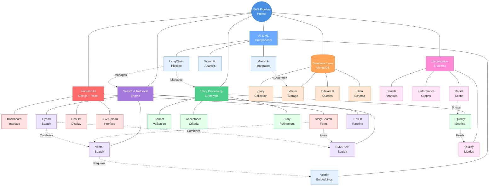

# RAG Pipeline for User Stories

This application implements a Retrieval Augmented Generation (RAG) pipeline for managing and analyzing user stories. It combines vector similarity search with traditional text search to find similar user stories and provides story refinement capabilities using the Mistral AI model.

## Application Structure

The application is built using Next.js 13 with the App Router and follows a clear separation between frontend and backend:

```
/app
  /api
    /rag-pipeline
      route.ts        # API endpoint for story analysis
  /userstory-rag
    page.tsx         # User story retrieval page
  page.tsx           # Main dashboard
/src
  /frontend
    /components      # Reusable React components
  /backend
    /db             # Database connection and utilities
/styles             # Shared styles
```

## Features

### 1. User Story Ingestion
- **Location**: Homepage (`app/page.tsx`)
- **Component**: `CSVIngestControl`
- **Functionality**: 
  - Upload CSV files containing user stories
  - Parse and validate story content
  - Store stories in MongoDB with embedded vector representations

### 2. User Story Retrieval
- **Location**: `/userstory-rag` route (`app/userstory-rag/page.tsx`)
- **Component**: User story search interface
- **Features**:
  - Input field for new user stories
  - Adjustable weights for vector and BM25 search
  - Display of similar stories with relevance scores

## How It Works: Search Similar Stories Flow

### 1. Frontend Flow (User Story Input)

The flow starts when a user enters a user story in the form:

1. **User Story Form Component** (`src/components/UserStoryForm.tsx`)
```typescript
// User input form with configurable search parameters
const UserStoryForm = () => {
    const [story, setStory] = useState('');
    const [vectorWeight, setVectorWeight] = useState(0.7);
    const [bm25Weight, setBm25Weight] = useState(0.3);
    
    // Form submission handler
    const handleSubmit = async (e: React.FormEvent) => {
        e.preventDefault();
        const response = await fetch('/api/rag-pipeline', {
            method: 'POST',
            body: JSON.stringify({
                story,
                config: {
                    vectorWeight,
                    bm25Weight,
                    topK: 5
                }
            })
        });
        const data = await response.json();
        // Update UI with results
    };
};
```

2. **Page Component** (`app/userstory-rag/page.tsx`)
```typescript
// Main page component integrating the form and results display
export default function UserStoryRAGPage() {
    // State for managing search results
    const [searchResults, setSearchResults] = useState([]);
    
    // Handler for receiving search results
    const onSearchComplete = (results) => {
        setSearchResults(results);
        // Trigger any necessary UI updates
    };
    
    return (
        <div>
            <UserStoryForm onComplete={onSearchComplete} />
            <SearchResults results={searchResults} />
        </div>
    );
}
```

### 2. Backend Processing Flow

The backend processing involves multiple components working together:

#### a. API Route Handler (`app/api/rag-pipeline/route.ts`)
```typescript
import { NextResponse } from 'next/server';
import { processUserStory } from '@/lib/story-processor';
import { findSimilarStories } from '@/lib/story-search';

export async function POST(request: Request) {
    const { story, config } = await request.json();
    
    // 1. Process and normalize the story
    const processedStory = await processUserStory(story);
    
    // 2. Find similar stories
    const similarStories = await findSimilarStories(processedStory, config);
    
    return NextResponse.json({
        normalized_story: processedStory.normalized,
        similar_stories: similarStories,
        quality_score: processedStory.qualityScore
    });
}
```

#### b. Story Processing (`src/lib/story-processor.ts`)
```typescript
// Handles story normalization and quality scoring
export async function processUserStory(story: string) {
    // 1. Format normalization
    const normalized = normalizeStoryFormat(story);
    
    // 2. Quality scoring
    const qualityScore = calculateStoryQuality(normalized);
    
    // 3. Generate embeddings using Mistral AI
    const embedding = await generateStoryEmbedding(normalized);
    
    return {
        normalized,
        qualityScore,
        embedding
    };
}
```

#### c. Story Search (`src/lib/story-search.ts`)
```typescript
// Implements hybrid search functionality
export async function findSimilarStories(
    story: ProcessedStory,
    config: SearchConfig
) {
    // 1. Vector similarity search
    const vectorResults = await findVectorSimilarities(story.embedding);
    
    // 2. BM25 text search
    const textResults = await findTextSimilarities(story.normalized);
    
    // 3. Combine and normalize results
    return combineSearchResults(
        vectorResults,
        textResults,
        config.vectorWeight,
        config.bm25Weight
    );
}
```

#### d. MongoDB Integration (`src/lib/mongodb-client.ts`)
```typescript
// Handles database operations for story storage and retrieval
export class MongoDBClient {
    // Vector similarity search
    async findSimilarVectors(embedding: number[]) {
        return this.collection.aggregate([
            {
                $search: {
                    knnBeta: {
                        vector: embedding,
                        path: "embedding",
                        k: 10
                    }
                }
            }
        ]).toArray();
    }
    
    // Text similarity search
    async findSimilarText(text: string) {
        return this.collection.aggregate([
            {
                $search: {
                    text: {
                        query: text,
                        path: "normalized_text"
                    }
                }
            }
        ]).toArray();
    }
}
```

### 3. Complete Processing Flow

1. **User Input** → `UserStoryForm.tsx`
   - User enters story
   - Sets search weights
   - Submits form

2. **API Request** → `page.tsx`
   - Form data serialized
   - Sent to API endpoint

3. **Initial Processing** → `rag-pipeline/route.ts`
   - Request validation
   - Story normalization
   - Quality scoring

4. **Vector Processing** → `story-processor.ts`
   - Mistral AI embedding generation
   - Vector normalization
   - Quality metrics calculation

5. **Search Execution** → `story-search.ts`
   - Vector similarity search
   - BM25 text search
   - Result combination and ranking

6. **Database Operations** → `mongodb-client.ts`
   - Vector search query
   - Text search query
   - Result aggregation

7. **Response Formation** → `rag-pipeline/route.ts`
   - Result formatting
   - Score normalization
   - Response assembly

8. **UI Update** → `UserStoryForm.tsx`
   - Display normalized story
   - Show similar stories
   - Present quality scores

The API processes the story in several steps:

a. **Story Normalization**
- Standardizes the format to "As a [role], I want [action] so that [value]"
- Cleans up whitespace and punctuation
- Ensures consistent capitalization

b. **Vector Embedding**
- Uses Mistral AI's embedding model to convert the story into a vector representation
- Enables semantic similarity search

c. **Hybrid Search**
1. Vector Similarity Search
   - Computes cosine similarity between the query story and stored stories
   - Captures semantic meaning and context

2. Text Similarity Search (BM25)
   - Uses word overlap to find similar stories
   - Captures keyword matches and exact phrases

3. Result Combination
   - Normalizes both similarity scores
   - Combines scores using user-defined weights
   - Returns top K most similar stories

### 3. Quality Scoring

The application scores user stories based on several criteria:
- Proper "As a... I want... so that..." format (+40 points)
- Presence of acceptance criteria (+30 points)
- Structured criteria format (+20 points)
- Adequate length (+10 points)

### 4. Story Refinement

The application can improve user stories using Mistral AI:
- Ensures proper user story format
- Makes stories more specific and measurable
- Adds clear acceptance criteria
- Focuses on user value

## Example Usage

1. **Story Ingestion**
   ```bash
   # Example CSV format
   Role,Action,Value
   customer,search for products,find what I need quickly
   admin,manage inventory,track stock levels accurately
   ```

2. **Story Retrieval**
   ```typescript
   // Example story input
   "As a developer, I want to implement error handling so that users receive clear feedback"
   
   // Example configuration
   {
     vectorWeight: 0.7,  // Emphasize semantic similarity
     bm25Weight: 0.3,    // Consider keyword matches
     topK: 5             // Return top 5 similar stories
   }
   ```

3. **Example Response**
   ```json
   {
     "normalized_new_story": "As a developer, I want to implement error handling so that users receive clear feedback.",
     "refined_story": "As a developer, I want to implement comprehensive error handling so that users receive clear, actionable feedback when issues occur.",
     "story_quality_score": 90,
     "ranked_related_stories": [
       {
         "content": "Similar story...",
         "vector_score": 0.85,
         "bm25_score": 0.75,
         "hybrid_score": 0.82
       }
     ]
   }
   ```

## Setup and Configuration

1. Install dependencies:
   ```bash
   npm install
   ```

2. Configure environment variables:
   ```env
   MONGODB_URI=your_mongodb_connection_string
   MISTRAL_API_KEY=your_mistral_api_key
   ```

3. Run the development server:
   ```bash
   npm run dev
   ```

4. Access the application at http://localhost:3000

## Technical Implementation Details

### Frontend Components

1. **Layout.tsx**
   - Provides consistent UI structure
   - Implements responsive sidebar navigation
   - Manages theme and styling

2. **UserStoryForm.tsx**
   - Handles story input and validation
   - Manages search weights through sliders
   - Displays search results in a structured format

3. **CSVIngestControl.tsx**
   - Handles CSV file uploads
   - Validates file format and content
   - Provides upload progress and feedback

### Backend Services

1. **MongoDB Integration**
   - Stores user stories and their vector embeddings
   - Enables efficient similarity search
   - Maintains metadata and quality scores

2. **Mistral AI Integration**
   - Generates story embeddings for semantic search
   - Provides story refinement capabilities
   - Ensures consistent story quality

3. **Hybrid Search Implementation**
   - Combines vector and text similarity
   - Normalizes scores for fair comparison
   - Provides configurable search weights

## Best Practices

1. **Story Writing**
   - Follow the "As a... I want... so that..." format
   - Include clear acceptance criteria
   - Be specific and measurable
   - Focus on user value

2. **Search Optimization**
   - Adjust weights based on search needs
   - Use vector search for semantic understanding
   - Use BM25 for keyword importance

3. **Data Management**
   - Regularly validate story quality
   - Maintain consistent formatting
   - Update embeddings when stories change

## Contributing

Contributions are welcome! Please read our contributing guidelines and submit pull requests for any enhancements.

## Project Mind Map



The mind map above provides a visual overview of the RAG Pipeline project's architecture, showing how different components interact with each other. The color coding helps distinguish different aspects of the system:

- 🔵 Blue: Core RAG Pipeline
- 🔴 Red: Frontend/UI Components
- 🟢 Green: Story Processing
- 🟣 Purple: Search Functions
- 🟠 Orange: Database Layer
- 🔷 Light Blue: AI Components
- 💗 Pink: Visualization Tools

Dotted lines show data flow and dependencies between different components.